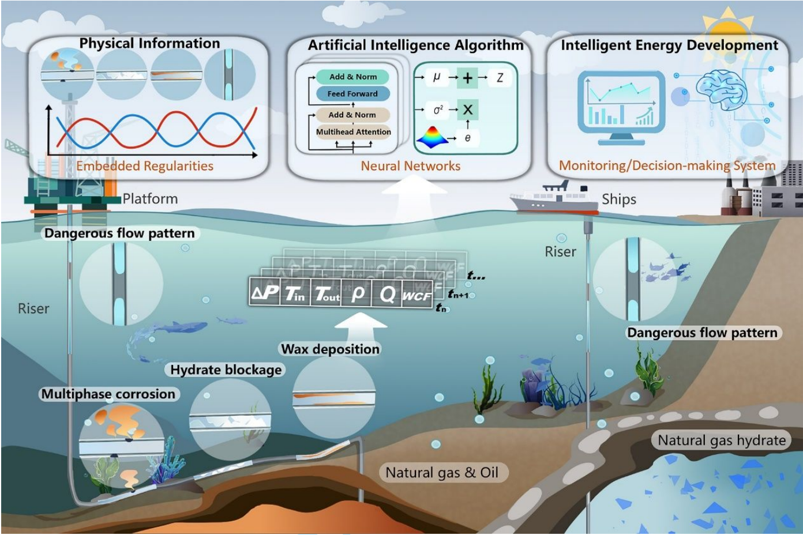
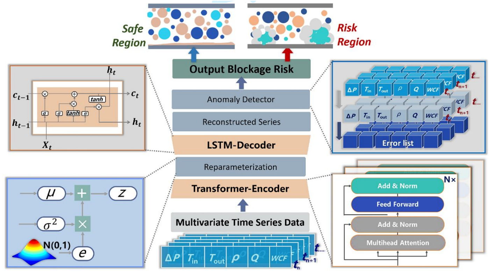
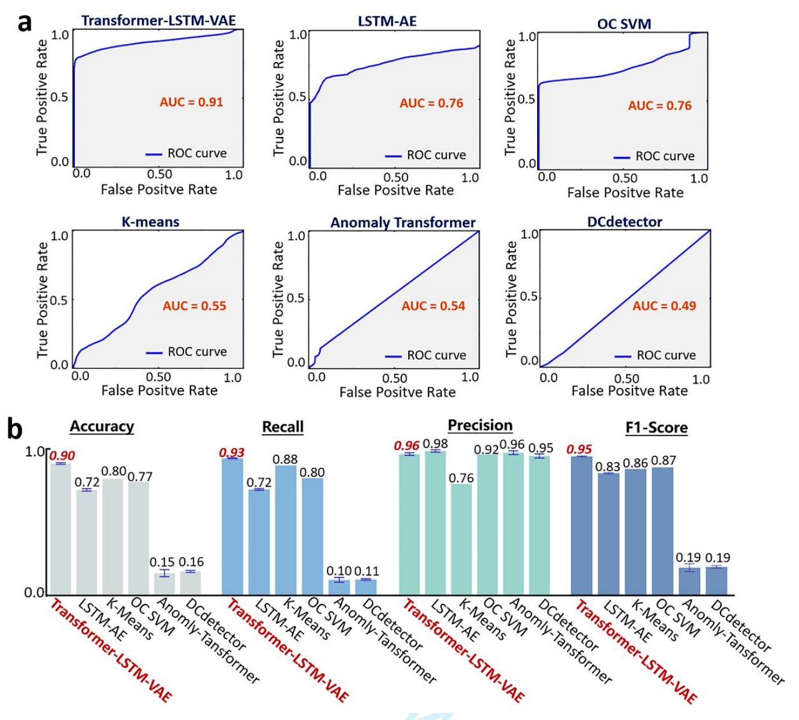

# Intelligent Deepwater Energy Development: flow assurance monitoring and smart decision-making system
---
<p align="center">
 📑 <a  href="" target="_blank">Paper</a> 
<p>



🎉 **Our paper has been recently accepted by _The Innovation Energy_** 🎉

## Introduction

The detection of hydrate blockages in deep-sea pipelines has long been a challenge for the industry. With the rapid development of machine learning and deep learning technologies, some efforts have been made to apply these methods to the prediction of hydrate blockages. 

However, most existing work relies on supervised machine learning techniques for predicting hydrate blockages, which results in models being highly dependent on labeled datasets. This dependency limits the application of supervised learning models. Therefore, we innovatively transform the hydrate blockage detection problem into an unsupervised one.


### Key Features & Contributions
- 🔍 **Unsupervised Framework**: First transformed the hydrate blockage detection problem into an unsupervised learning task to adapt to varying data distributions under different working conditions and overcome data labeling difficulties.
- 🧠 **TLV Model**: Proposed a Transformer-LSTM model within the VAE framework, which combined the long-range sequence information extraction ability of Transformer with the sequence generation capability of LSTM.
- 📊 **Dynamic Weight Adjustment for Threshold Setting**: Proposed a dynamic weight adjustment mechanism that increases the model's sensitivity to subsequent data. In practical industrial applications, this improvement facilitates earlier warnings of potential blockages.
- 📁 **Loop Data forh Hydrate Blockage Detection**: Open-sourced a large-scale loop dataset that can simulate the blockage process of deep-sea pipelines under real-world conditions.



Our model achieves state-of-the-art (SOTA) performance on this proposed dataset, outperforming several unsupervised methods.

## Main Result
We compare our model with 5 baselines, including KMeans, Anomaly Transformer, etc. Generally, our model achieves SOTA.

Especially, we abandon the adjustment operation used in Anomoly-Transformer and DCdetector for **fair** model evaluation.

## Getting Started

1. **Environment**. We support python environment created by **conda**. You can prepare the environment by the following instrution. Make sure that your cuda version is suitable with your tensorflow version，otherwise it would causes GPU not available problems.

   ```bash
   conda create --name tlv python==3.10 # use python3.10
   conda activate tlv
   pip install -r requirements.txt
   pip install openpyxl
   ```

2. **Download data**. You can obtain the proposed loop dataset by click [here ](https://github.com/IDED-TLV/IDED-TLV/blob/main/data/Database.xlsx) or you can use data from `data/database.xlsx` directly.

3. **Train and evaluate**. You can use the [`run.py`](https://github.com/IDED-TLV/IDED-TLV/blob/main/run.py) to train and evaluate model. In Linux，you can directly execute the [`train.sh`](https://github.com/IDED-TLV/IDED-TLV/blob/main/script/train.sh) and the [`test.sh`](https://github.com/IDED-TLV/IDED-TLV/blob/main/script/test.sh) to do the same thing. You can custom your own config in [`config.json`](https://github.com/IDED-TLV/IDED-TLV/blob/main/config/config.json).

   ```bash
   python run.py --mode [train | test] --config_path "config/config.json"
   
   # For Linux
   bash script/train.sh
   bash script/test.sh
   ```

4. **Model Checkpoint**. You can obtain the existing model checkpoint by click [here](https://github.com/IDED-TLV/IDED-TLV/blob/main/models_pth/transformer-lstm-vae-all-feature.h5), which is identical to the model used in our experiments.

5. **Inference Demo**. You can quickly start an inference demo using the [i`infer_demo.py`](https://github.com/IDED-TLV/IDED-TLV/blob/main/infer_demo.py). In Linux，you can directly execute the [`infer.sh`](https://github.com/IDED-TLV/IDED-TLV/blob/main/script/train.sh) to do the same thing. Relying on this file, you can further proceed with production-level deployment.

   ```bash
   python infer_demo.py --config_path "config/config.json"
   
   # For Linux
   bash script/infer.sh
   ```

## TODO

<ul>
  <li style="color: green;">✔ Open source our database (include train, test, deploy demo)</li>
  <li style="color: green;">✔ Organize and open source our codebase</li>
  <li style="color: green;">✔ Add the README profile</li>
  <li style="color: red;">✘ Add the paper's citation</li>
</ul>

## Citation

```
waiting to fill...
```
