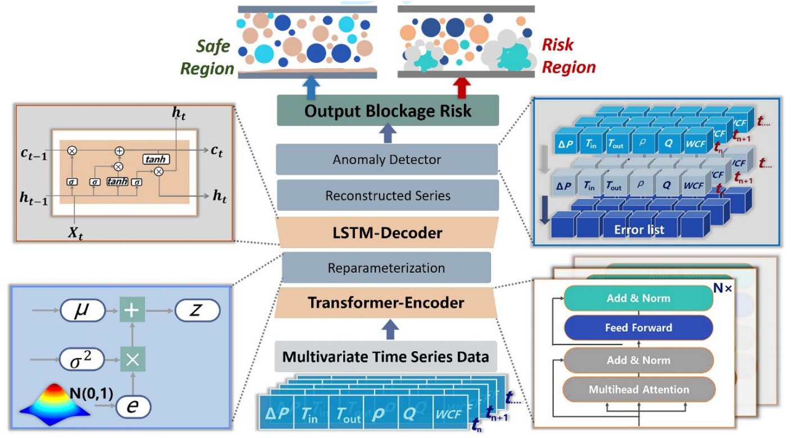

# Intelligent Deepwater Energy Development: flow assurance monitoring and smart decision-making system
---
<p align="center">
 📑 <a  href="https://www.the-innovation.org/article/doi/10.59717/j.xinn-energy.2025.100081" target="_blank">论文</a> | 
 🇬🇧 <a  href="https://github.com/IDED-TLV/IDED-TLV/blob/main/README.md">英文版</a>
<p>


🎉 **我们的论文目前已被期刊 _The Innovation Energy_ 接收** 🎉

## 简介

自水合物被人们发现以来，深海油气传输管道中的水合物堵塞检测一直以来都是工业界面临的重大挑战之一。随着机器学习和深度学习技术的迅猛发展，一些工作已经开始尝试将这些方法应用于水合物堵塞的预测。

然而，现有的大多数工作依赖于有监督的机器学习技术进行水合物堵塞的预测，这导致模型高度依赖于有标注的数据集，进一步限制了有监督学习模型的应用。因此，我们创新性地将水合物堵塞检测问题转换为一个无监督异常检测问题。


### 核心贡献
- 🔍 **无监督异常检测框架**: 本工作首次将水合物堵塞检测问题转换为一个无监督学习任务，以适应不同工况条件下的数据分布变化，并克服数据标注的困难。
- 🧠 **TLV 模型**: 提出了一种基于变分自编码器（VAE）框架的 Transformer-LSTM 模型，该模型结合了 Transformer 的长距离序列信息提取能力和 LSTM 的序列生成能力。
- 📊 **动态阈值权重调整机制**: 提出了一种动态权重调整机制，该机制提高了模型对后续数据的敏感性。在实际工业应用中，有助于提前预警潜在的堵塞问题。
- 📁 **大规模环路数据**: 开源了一个大规模环路数据集，该数据集可以模拟深海管道在真实条件下的堵塞过程。



我们的模型在该数据集上达到SOTA，超越了多个无监督的深度学习方法。

## 实验结果
我们将所提出的TLV模型与5个基线模型进行了比较，包括KMeans、Anomaly Transformer等。总体而言，我们的模型达到了SOTA。

特别地，为了进行**公平**的模型评估，我们放弃了在Anomaly Transformer和DCdetector中使用的Detection Adjustment操作。

## 快速开始
1. **环境配置**。我们支持通过 conda 创建的 Python 环境。你可以按照以下指令来准备环境。请确保你的 CUDA 版本与 TensorFlow 版本相匹配，否则可能会导致“GPU 不可用”的问题。

   ```bash
   conda create --name tlv python==3.10 # use python3.10
   conda activate tlv
   pip install -r requirements.txt
   pip install openpyxl
   ```

2. **下载数据**. 你可以点[这里](https://github.com/IDED-TLV/IDED-TLV/blob/main/data/Database.xlsx)获取到所提出的环路数据

3. **训练与评估**. 你可以用 [`run.py`](https://github.com/IDED-TLV/IDED-TLV/blob/main/run.py) 来训练和评估模型. 在Linux操作系统里，你也可以直接使用脚本 [`train.sh`](https://github.com/IDED-TLV/IDED-TLV/blob/main/script/train.sh) 和 [`test.sh`](https://github.com/IDED-TLV/IDED-TLV/blob/main/script/test.sh)。 你可以在 [`config.json`](https://github.com/IDED-TLV/IDED-TLV/blob/main/config/config.json)自定义你的实验配置。

   ```bash
   python run.py --mode [train | test] --config_path "config/config.json"
   
   # For Linux
   bash script/train.sh
   bash script/test.sh
   ```

4. **模型权重**. 你可以点击 [这里](https://github.com/IDED-TLV/IDED-TLV/blob/main/model_pth/transformer-lstm-vae-all-feature.h5) 来获取现成的模型权重，这份权重和我们在实验中使用的是一致的.

5. **推理 Demo**. 你可以通过 [`infer_demo.py`](https://github.com/IDED-TLV/IDED-TLV/blob/main/infer_demo.py) 来快速开启一个推理Demo。 在Linux操作系统中，你也可以直接使用 [`infer.sh`](https://github.com/IDED-TLV/IDED-TLV/blob/main/script/train.sh)。依赖于这个文件，你可以进一步部署该模型于实际生产环境中。 

   ```bash
   python infer_demo.py --config_path "config/config.json"
   
   # For Linux
   bash script/infer.sh
   ```

## 待做

- ✅ 开源我们的数据库
- ✅ 开源代码（包括训练、测试、部署demo）
- ✅ 添加README
- ✅ 添加论文的引用

## 引用

```
@article{wang2025intelligent,
  title={Intelligent Deepwater Energy Development: flow assurance monitoring and smart decision-making system},
  author={Wang, Jiguang and Yang, Bowen and Jin, Kaiming and Zhang, Lunxiang and Wang, Linhe and Jiang, Bo and Yao, Haiyuan and Song, Yongchen},
  journal={The Innovation Energy},
  year={2025},
  publisher={The Innovation Energy}
}
```
